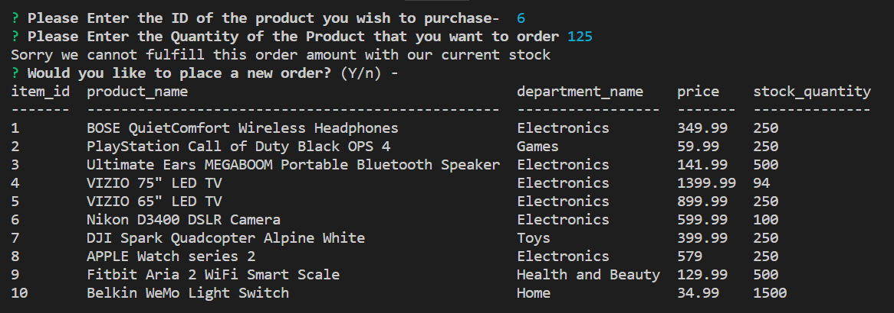

# BAMAZON

*An interactive storefront that is run in console and utilizes Node.*

----------

## Overview of the Application

BAMAZON storefront is a program that allows our customer to place an order from the BAMAZON store. The customer can select a product to order and the amount of the product that they wish to order. Our program will verify that the item number that they select is a valid item and check to see if it is available. If the item is not available a "Sorry we are currently out of stock" message will be displayed in the console. If the item is in stock, a "Thank you for your order!" message will be displayed in the console along with the order total and the quantity and description of the item ordered.

## Figure 1. The Store Inventory

- **This image depicts the store inventory before the order is entered**

## Figure 2. The Order

- **This image depicts the order entry and corresponding results**

## Figure 3. The Inventory after the successful sale

- **This image depicts the inventory change from the successful order**

## Figure 4. The Unsuccessful Order

- **This image depicts a "Sorry we cannot fulfill this order amount with our current stock" message and no inventory change from the unsuccessful order**

## Technology used on this project

- **JavaScript**
- **Node.js**
- **MySql Database**
- **MySql NPM Package**
- **Inquirer NPM Package**
- **Console.table NPM Package**

----------

## Author

** Joe McCreesh**
